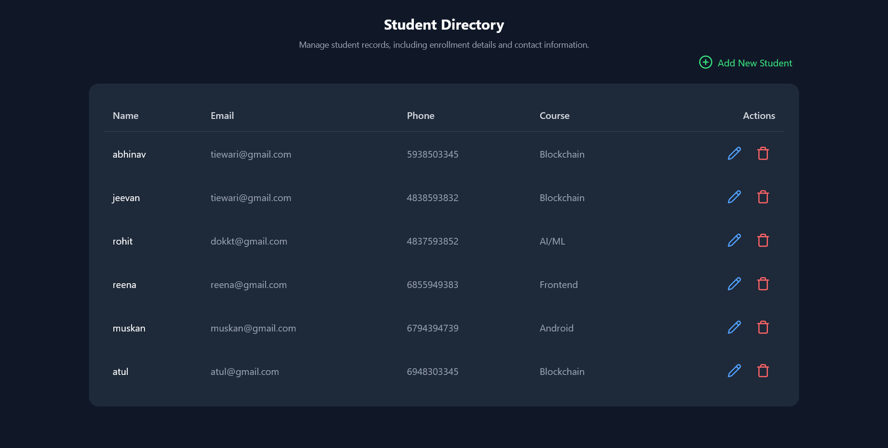

# 🎓 Student Registration System (React + TypeScript + JSON Server)

A simple student management system built with **React + TypeScript**, Mobile first, using **JSON Server** as a mock backend.  
The project includes **secure AES encryption** for storing student data, login functionality, and CRUD operations.

---

## 🚀 Features
- **User Authentication**
  - Login with email & password
  - AES encryption/decryption for password & student data
  - Show/Hide password toggle
    
- **Student Registration**
  - Form validation (name, phone, email, password, etc.)
  - Data is encrypted before saving
  - 
- **Student Directory**
  - Fetch student records
  - View list of students
  - Edit student details (modal popup)
  - Delete students

- **Tech Stack**
  - React + TypeScript
  - TailwindCSS (for styling)
  - Shadcn (for styling components)
  - JSON Server (Database)
  - Axios (API calls)
  - CryptoJS (AES encryption, Crypto encryption)
  - Sonner (toast notifications)
  - Lucide Icons (icons)

---

## What is AES?
- AES (Advanced Encryption Standard) is a symmetric encryption algorithm.
- Symmetric → the same key is used to encrypt and decrypt.
- It works by scrambling your plain text into something unreadable (ciphertext).
#### Example:
    Plain text: mypassword123
    AES Encrypted: U2FsdGVkX18rmbqH1v2DJ7g...
    Decrypted: mypassword123


# Screenshots

## Login Page


## Register Page


## Student Directory


## Edit modal


## 🛠️ Setup Instructions

### 1. Clone the repository
Create a React app and install tailwind css also install shadcn and then Yooo
```bash
git clone https://github.com/Avhinaw/Student-Registration
cd student-management
npm i
npm run dev #(for frontend working)
npm run server #(for json server running)
